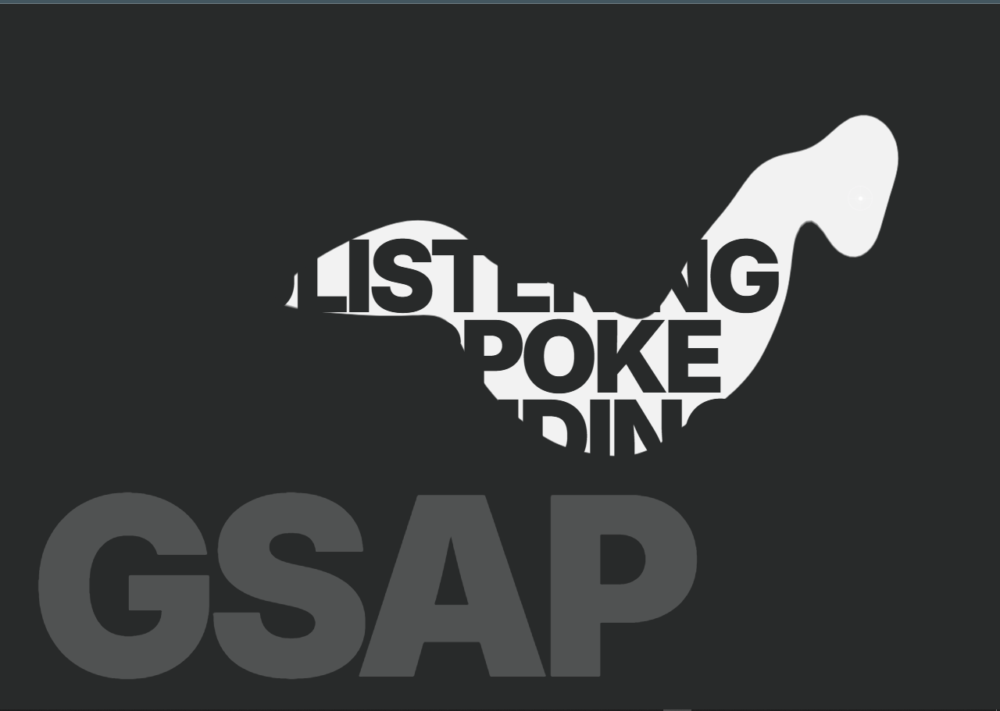
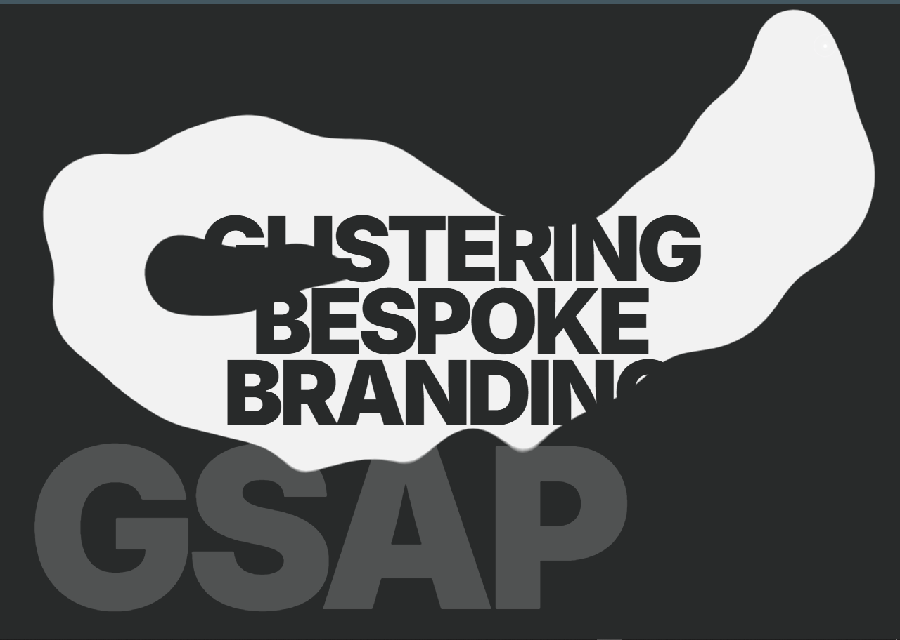

# Gooey SVG Cursor Reveal | High-Performance GSAP Animation

[](https://greensock.com/gsap/)
[](https://reactjs.org/)
[](https://vitejs.dev/)

A premium, interactive **Gooey SVG Reveal** effect built with GSAP and React. This project demonstrates advanced SVG masking techniques combined with liquid-like physics filters to create a captivating "smudge-paint" reveal interaction.

---

## 🚀 Visual Showcase


*Dynamic Gooey Reveal in action*


*Smooth SVG Masking and Liquid Physics*

---

## ✨ Key Features

- **Liquid Gooey Physics**: Utilizes `feGaussianBlur` and `feColorMatrix` SVG filters to create a organic, fluid blending effect between reveal spots.
- **Dynamic SVG Masking**: A high-performance masking system that reveals hidden content (images or text) based on cursor movement.
- **Velocity-Responsive Reveal**: The radius of the reveal "paint" scales dynamically based on the speed of the mouse movement.
- **Auto-Dissolve Mechanism**: Revealed areas expand smoothly and then dissolve, creating a temporary trail that feels alive.
- **Custom Aesthetic Cursor**: A bespoke, professional cursor component with pulse animations and compass-style decorative elements.
- **Optimized Performance**: Built using GSAP's `quickTo` for 60fps cursor tracking and efficient DOM management for SVG elements.

---

## 🛠️ Tech Stack

- **Framework**: [React.js](https://reactjs.org/)
- **Animation**: [GSAP (GreenSock Animation Platform)](https://greensock.com/gsap/)
- **Styling**: [Tailwind CSS](https://tailwindcss.com/)
- **Build Tool**: [Vite](https://vitejs.dev/)
- **Masking**: SVG Masks & Filters

---

## 🧩 Core Logic Explained

### 1. The Gooey Filter
The "liquid" look is achieved through a combination of a high-standard deviation blur and a high-contrast color matrix:
```xml
<filter id="sumdge-goo">
  <feGaussianBlur in="SourceGraphic" stdDeviation="35" result="blur" />
  <feColorMatrix in="blur" type="matrix" values="1 0 0 0 0  0 1 0 0 0  0 0 1 0 0  0 0 0 45 -15" result="goo" />
  <feComposite in="SourceGraphic" in2="goo" operator="atop" />
</filter>
```

### 2. SVG Masking
We use a `mask` containing a group of dynamically generated circles. These circles are "stamped" at the cursor's coordinates whenever the movement threshold is exceeded.

---

## ⚙️ Installation & Usage

1. **Clone the repository:**
   ```bash
   git clone https://github.com/yourusername/gooey-svg-reveal.git
   ```

2. **Install dependencies:**
   ```bash
   npm install
   ```

3. **Run the development server:**
   ```bash
   npm run dev
   ```

---

## 🎨 Customization

You can easily tweak the effect by modifying the `config` object in `GooeyCursorReveal.jsx`:

```javascript
const config = {
  smoothing: 0.15,          // Cursor smoothing factor
  movementThreshold: 1.5,   // Density of the trail
  sizeFromSpeed: 0.6,       // How much speed affects size
  expandMultiplier: 2.8,    // How much spots grow
  expandTime: 2,            // Time to reach full size
  dissolveTime: 4,          // Duration of the fade-out
}
```

---

## 📄 License

This project is licensed under the MIT License - see the [LICENSE](LICENSE) file for details.

---

<div align="center">
  <p>Built with ❤️ using GSAP and React</p>
</div>
